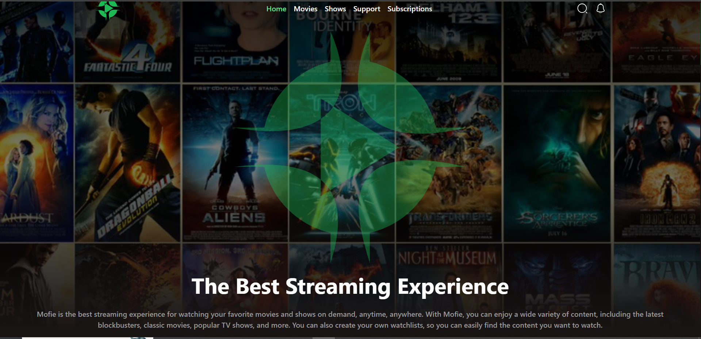
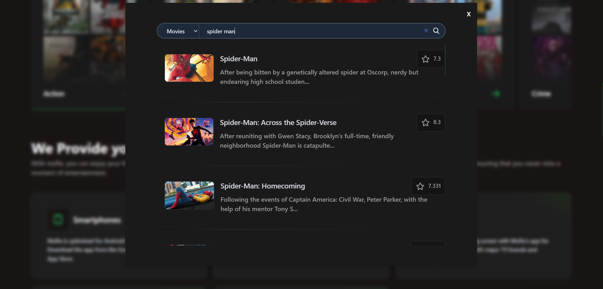
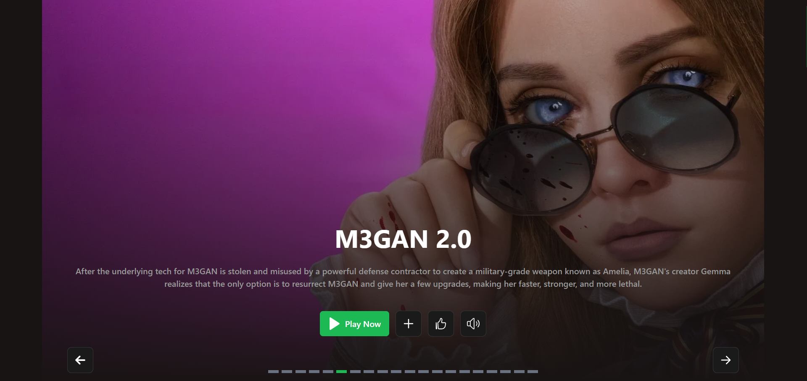
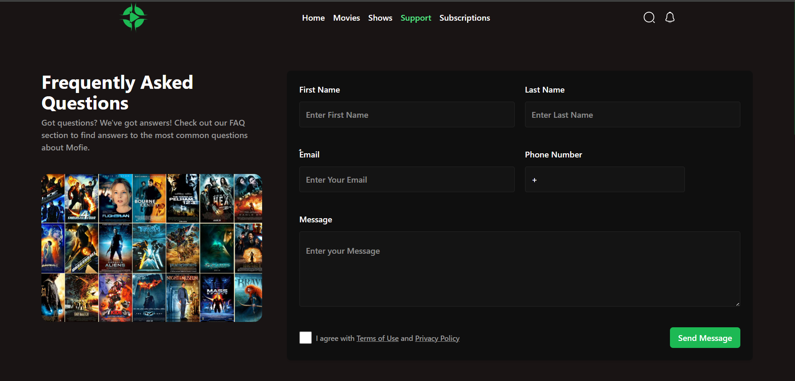
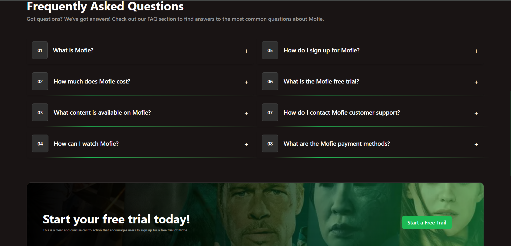
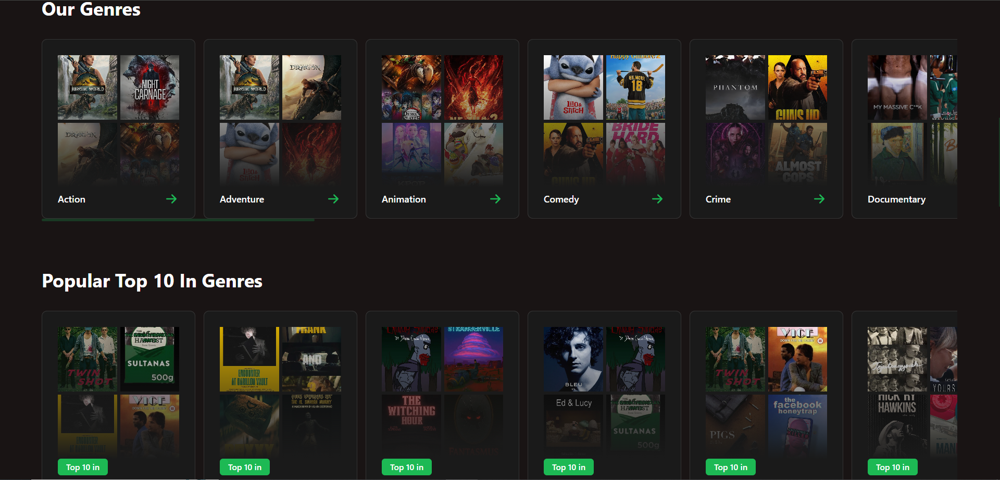
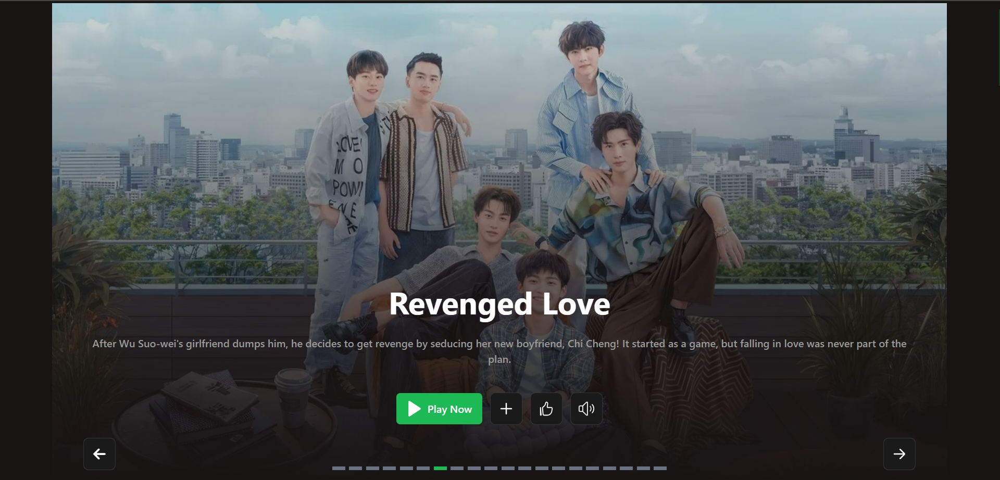

# 🎬 Mofie – Movie Discovery Web App

Mofie is a sleek and responsive movie browsing platform built with **React.js** and powered by the **TMDB API**. It allows users to explore trending films, search by title, and view detailed movie information—all wrapped in a clean, modern UI optimized for both desktop and mobile.

---

## 🚀 Features

- 🔥 Trending Movies: Displays the latest popular films on the homepage  
- 🔍 Search Functionality: Search for movies by title with real-time results  
- 📄 Movie Details: View posters, overviews, ratings, release dates, and more  
- 🌙 Dark Mode *(optional)*: Toggle between light and dark themes for better UX  
- 📱 Responsive Design: Fully optimized for mobile, tablet, and desktop screens  

---

## 🛠️ Tech Stack

| Technology     | Purpose                          |
|----------------|----------------------------------|
| React.js       | Frontend framework               |
| TMDB API       | Movie data source                |
| Axios          | API requests                     |
| React Router   | Client-side routing              |
| CSS Modules    | Component-scoped styling         |

---

## 📦 Installation & Setup

To run Mofie locally:

```bash
# Clone the repository
git clone https://github.com/himafr/mofie.git

# Navigate into the project folder
cd mofie

# Install dependencies
npm install

# Create a .env file and add your TMDB API key
echo "REACT_APP_TMDB_API_KEY=your_api_key_here" > .env

# Start the development server
npm start

The app will run on http://localhost:3000 by default.

🌐 Live Demo

Want to see it in action? 👉 Live Site (https://mofie-tv.netlify.app/)

📸 Screenshots








🤝 Contributing
Contributions are welcome! If you'd like to improve the app, feel free to fork the repo and submit a pull request.

bash
# Fork the project
# Create your feature branch
git checkout -b feature/YourFeature

# Commit your changes
git commit -m 'Add YourFeature'

# Push to the branch
git push origin feature/YourFeature

# Open a pull request

📄 License
This project is licensed under the MIT License. Feel free to use, modify, and distribute with attribution.

🙋‍♂️ Author
Hema – Full-stack developer passionate about automation, clean UI, and hands-on learning. 📎 GitHub Profile